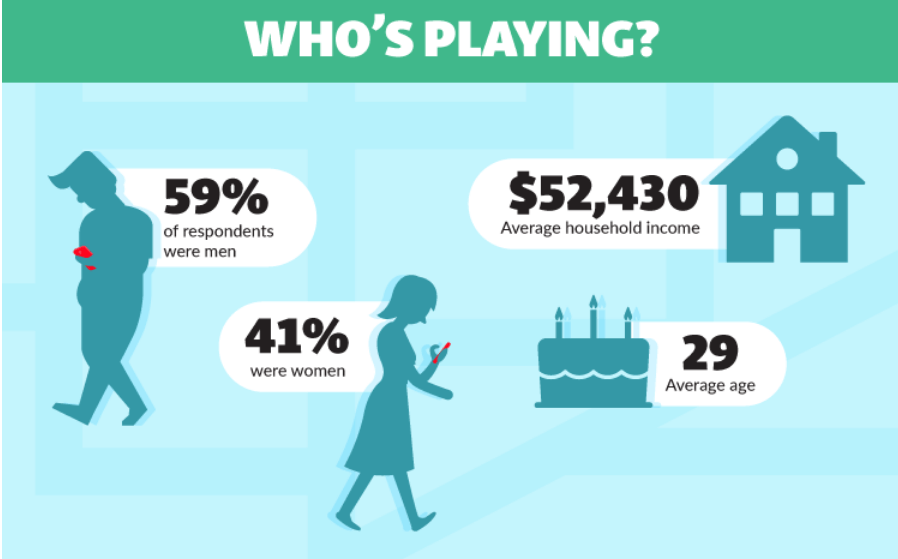

# PokéPoket

## Índice

* [1. Preámbulo](#1-preámbulo)
* [2. Definición de usuario](#2-definición-de-usuario)
* [3. Definición UX](#3-definición-ux)
* [4. Desarrollo de Interfaz UI](#4-desarrollo-de-interfaz-ui)
* [5. Problema de usabilidad](#5-problema-de-usabilidad)
* [6. Conclusiones](#6-conclusiones)

***

## 1. Preámbulo

Pokémon GO es una experiencia de juego internacional y ha sido nombrada "el mejor juego para móviles". El objetivo de nuestra web es ofrecer información detallada sobre los Pokemones y con un facil acceso.

## 2. Definición de usuario

La estadística realizada por statista.com muestra que en Latino America existe 44 millones de usuarios de Pokemon Go. (foto grafico statista)

Según las estadísticas de comScore Pokémon Go realizadas al principio del año 2017, el 60% de la audiencia tenía entre 18 y 34 años (los que se encontrarian entre el rango de los llamados Millennials y una parte de la Gen Z que abarca entre 1981-1996).

 Apptopia informó a mediados de 2017 que el 57.4% de los jugadores de Pokémon Go eran hombres, también encontró un porcentaje más bajo de usuarios Millennials, siendo un 38%. Otro 32% tenía menos de 18 años, lo que le dio al juego una división fascinante en términos de los grupos de edad de los usuarios de Pokémon Go. Una pequeña encuesta de los Estados Unidos realizada por Inc. y publicada en agosto de 2016 encontró una división de género similar; 59% hombres y 41% mujeres. Este estudio estableció la edad promedio de los jugadores de Pokémon Go en 29 años, y encontró un ingreso familiar promedio de US$52,430
 

### Historia de usuario:

* Usuario N° 1:
  * El usuario lleva poco tiempo jugando y quiere empezar a combatir.
  * Entra a nuestra página para buscar información sobre fortaleza y debilidades de los Pokemones que tiene y así saber cuál se sirve en cada combate.
* Definición de hecho:
  * Al ingresar se encuentra el listado de Pokemon ordenados por número creciente. El usuario puede elegir entre orderar alfabeticamente de A a Z, de Z a A o por número decreciente. También en la parte izquierda puede filtrar por tipo y debilidad. Una vez que se muestra el listado, hacer click al Pokemon deseado se abre una ventana más información sobre el Pokemon.

## 3. Definición UX

La web es una enciclopedia de Pokemones, contiene un listado y sus características por cada uno de ellos. Los usuarios pueden encontrarlos a través del buscador, usando los filtros u ordenando alfabéticamente. La web ayuda a los usuarios del juego Pokemon Go a conocer las características y las debilidades de cada Pokemon.

### Requerimientos de la web: 
* La información debe ser detallada y fácil de accesar
* Permitir al usuario buscar por filtros, ordenar por distintas opciones: alfabéticamente, por números, etc.
* Debe visualizarse sin problemas desde distintos tamaños de pantallas: móviles, tablets y desktops.
* Diseño adecuado al rubro y a los usuarios 

### Sketch, prototipo de baja fidelidad

### Planificación
La planificación de las tareas se han definido usando [Trello](https://trello.com/b/P7UBUevO/deta-lover) en conjunto a los daily diarios.

### Decisiones de diseño

En cuanto el diseño, como partida, se tomó en cuenta la página oficial de Pokemon que usa una barra de menú obscura, iconos para las secciones y colores vivos. El contenido es en orientación de caja con fondo blanco y fuera del de la caja principal el fondo es negro. Considerando esto hemos elegido usar un color obscuro para el menú, naranjo como color primaria y blanco para el fondo.

### Prototipo de alta fidelidad
El prototipo de alta fidelidad para el testeo se realizó en Figma, en un principio se hicieron pruebas de color, composición y diseño, para finalmente llegar a un prototipo definitivo como maqueta base para la construcción de la página.
* Primera versión 

* Prueba de usabilidad de la primera versión
[Loom prueba 1](https://www.loom.com/share/23309f87042341368c38833f4aa01a6f)
* Pruebas de usabilidad después de la primera iteración
[Loom prueba 1](https://www.loom.com/share/819180616ea74e839cd8662c1f240b17)
[Loom prueba 2](https://www.loom.com/share/4af0f30692d64767bdc308514c554fe6)
[Loom prueba 3](https://www.loom.com/share/8711d564d7904538aa2009b49c88e0ea)
* Prototipo final
[Figma](https://www.figma.com/file/Z6eCUuv54KqSj4ihp30RaK/PokePocket).

## 4. Desarrollo de la interfaz UI

### Paleta de colores
Color primario: 
  * Naranjo es asociado a la juventud, aventura, alegría, sociabilidad, lo que hace que sea adecuada para el publico objetvo de nuestra página relacionado al juego PokemonGO. 
  * Negro es usado para obtener contraste con el naranjo.
  * Blanco para el fondo, resalta el contenido y ofrece un diseño limpio y moderno. 

### Tipografías
Se utilizaron dos tipografías, <strong>Play</strong> para títulos y <strong>Rajdhani</strong> para párrafos.
<strong>Play</strong> es una tipografía moderna y minimalista de tipo sans serif. Todas las letras en Play derivan de la 'O' - cuadrada y circular al mismo tiempo.
<strong>Rajdhani</strong> es un tipo de letra geométrico sans-serif. El diseño presenta formas de letras condensadas con lados planos, similar al estilo de gaspipe (tubería de gas) que era popular en el diseño de carteles de principios del siglo XX pero con una inclinación más "futurista".

## 5. Conclusiones
La web está enfocada a resolver los problemas de los usuarios de PokemonGo que quieran comenzar en el mundo de combates y no saben que tipo de Pokemon es más adecuado. A fin de darle un facil acceso a los detalles de cada Pokemon el despliegue es automatico al entrar a la página, posteriormente el usuario puede recorrer y buscar en mas detalles las caracteristicas de los Pokemones o bien utilizar el filtro directamente para conocer la debilidad de los mismos. Por otro lado puede recorrer uno a uno los Pokemones y saber un poco más sobre sus caracteristicas. 

El diseño se ha realizado teniedo en cuenta el diseño de la página oficial Pokemon y el feedback recibido por los test de usabilidad. De estaa manera logramos que la web se viese muy similar a lo estimado en nuestro prototipo de alta fidelidad y mauqetacion final. Del mismo modo se genero un diseño adaptable a distintos dispositivos haciendolo cómodo de consultar en smartphones o tables para fortalecer su complementariedad con la el juego mismo que se utiliza principalmente a través de estos dispositivos.

## 6. Por Mejorar...
Dentro de los test de usabilidad realizados, los usuarios se{alaron que seria importante poder seleecionar sus pokemones favoritos y que estos fueran los primeros en aparecer en la pagina, para asi conocer mas rapidamente su informacion y si estos son fuertes o no contra determinado tipo de contrincante, asi como conocer el miltipicador del poder de combate para saber que tan fuerte son los Pokemon de su colección. Es entonces que a futuro se implementarian una sección de "Favoritos" y una pequeña calculadora con el "Multiplicador" para los puntos de combate, de tal modo que el jugador tenga una proyeccion del poder que podrian alcanzar sus Pokemones favoritos de combate.

### Esta página fue construida con:

- HTML
- JavaScript
- CSS

### Autores:

- Monica Bartha
- KarJC