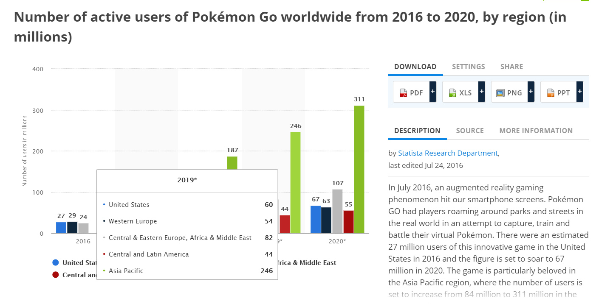
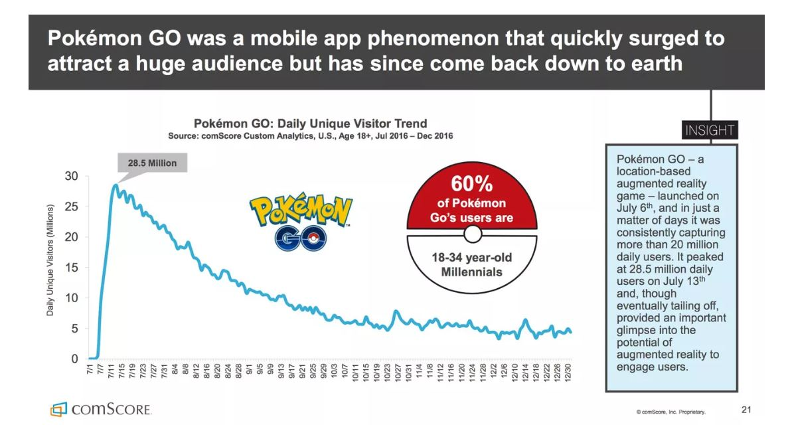
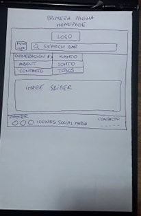
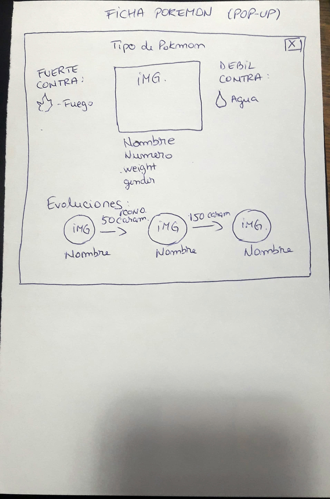
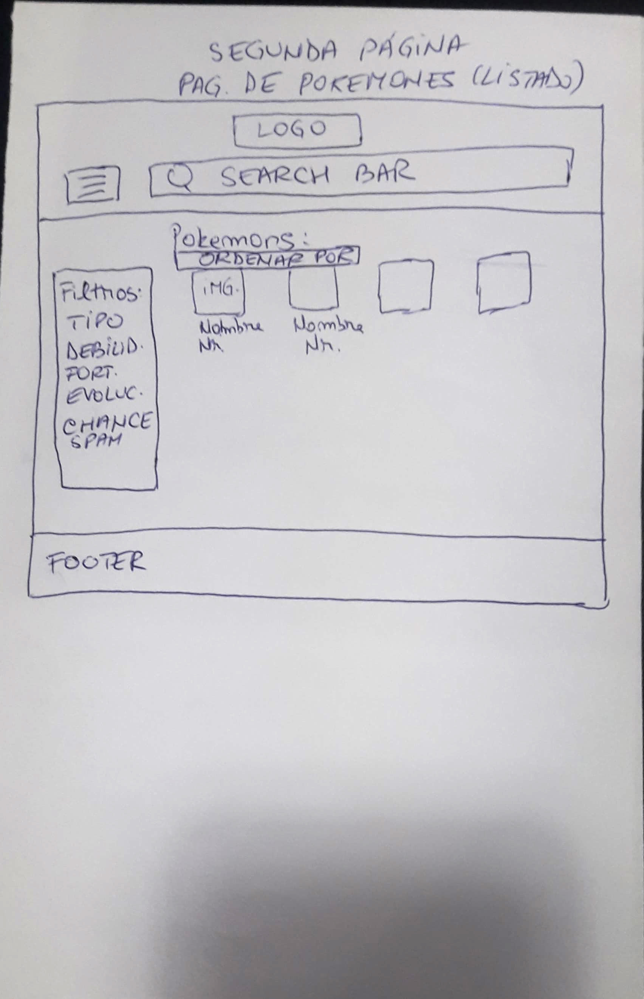
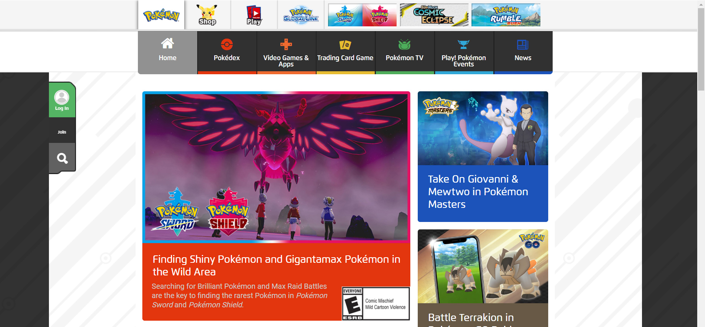
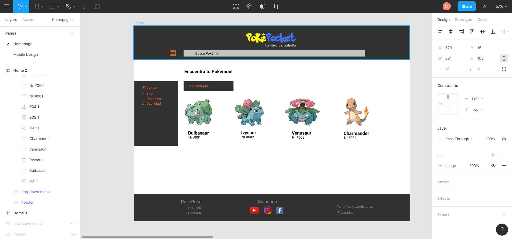
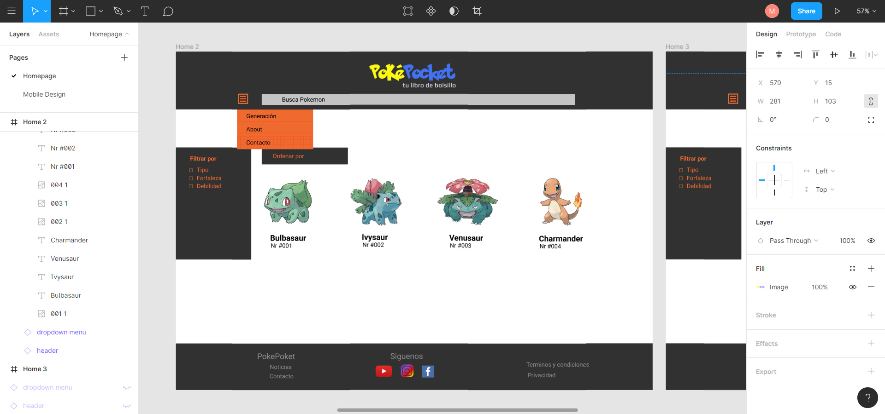
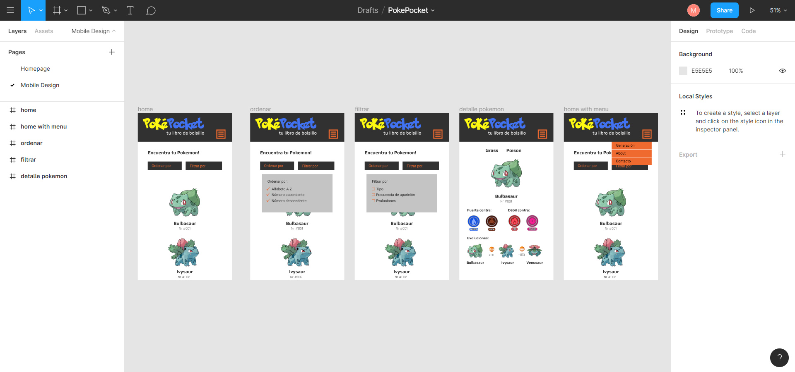
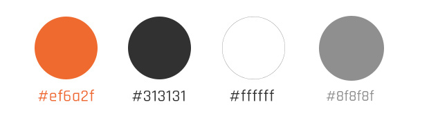

# PokéPoket

## Índice

* [1. Preámbulo](#1-preámbulo)
* [2. Definición de usuario](#2-definición-de-usuario)
* [3. Definición UX](#3-definición-ux)
* [4. Desarrollo de Interfaz UI](#4-desarrollo-de-interfaz-ui)
* [5. Testeos](#5-testeos)
* [6. Problema de usabilidad](#6-problema-de-usabilidad)
* [7. Mejoras](#7-mejoras)
* [8. Conclusiones](#8-conclusiones)

***

## 1. Preámbulo

Pokémon GO es una experiencia de juego internacional  y ha sido nombrada "el mejor juego para móviles". El objetivo de la web ofrecer información detallada sobre los Pokemones y que sea fácil de acceder.

## 2. Definición de usuario

La estadística realizada por statista.com muestra que en Latino America existe 44 millones de usuarios de Pokemon Go. (foto grafico statista)

Según las estadísticas de comScore Pokémon Go realizadas al principio del año 2017, el 60% de la audiencia tenía entre 18 y 34 años (los Millennials, pero podríamos argumentar que una buena parte de ellos sería Gen Z también si adoptamos la medida 1981-1996 ).

 Apptopia informó a mediados de 2017 que el 57.4% de los jugadores de Pokémon Go eran hombres, también encontró un porcentaje más bajo de usuarios Millennials (en este caso usando 19-34 como medida), reportando 38%. Otro 32% tenía menos de 18 años, lo que le dio al juego una división fascinante en términos de los grupos de edad de los usuarios de Pokémon Go. Una pequeña encuesta de los Estados Unidos realizada por Inc. y publicada en agosto de 2016 encontró una división de género similar; 59% hombres y 41% mujeres. Este estudio estableció la edad promedio de los jugadores de Pokémon Go en 29, y encontró un ingreso familiar promedio de $ 52,430
 

### Historia de usuario:

* Usuario nr 1:
  * Lleva poco tiempo jugando y quiere empezar a combatir.
  * Entra a nuestra página para buscar información sobre fortaleza y debilidades de los Pokemones que tiene y así saber cuál se sirve para el combate.

## 3. Definición UX

La web es una enciclopedia de los Pokemones, contiene listado de los Pokemones y sus características. Los usuarios pueden encontrarlos a través del buscador, usando los filtros o ordenar alfabéticamente. La web ayuda a los usuarios del juego Pokemon Go a conocer las características y los poderes de cada Pokemon.
### Requerimientos de la web: 
* La información debe ser detallada y fácil de accesar
* Permitir al usuario buscar por filtros, ordenar por distintas reglas: alfabéticamente, por números, etc.
* Debe visualizarse sin problemas desde distintos tamaños de pantallas: móviles, tablets y desktops.
* Diseño adecuado al rubro y a los usuarios 

### Sketch, prototipo de baja fidelidad

### Planificación
La planificación de las  tareas  se han definido usando Trello 
[Trello](https://trello.com/b/P7UBUevO/deta-lover).

### Decisiones de diseño

En cuanto el diseño, como partida, se tomó en cuenta la página oficial de Pokemon Go que usa una barra de menú obscura, iconos para las secciones y colores vivas. El contenido es en orientación boxed con backgroud blanco y fuera del box el background negro. Considerando esto hemos elegido usar un color obscuro para el menú, naranjo como color primaria y blanco para el background.

### Prototipo de alta fidelidad
El prototipo de alta fidelidad para el testeo se realizó en Figma, en un principio se hicieron pruebas de color, composición y diseño. Hasta que finalmente de llegó al prototipo definitivo.
* Primera versión 

* Prototipo final
[Figma](https://www.figma.com/file/Z6eCUuv54KqSj4ihp30RaK/PokePocket).

## 4. Desarrollo de la interfaz UI
### Paleta de colores
Color primario: 
  * Naranjo es asociado a la juventud, aventura, alegría, sociabilidad, lo que hace que sea adecuada para nuestra web relacionada al juego Pokemon. 
  * Negro es usado para obtener contraste con el naranjo.
  * Blanco para el background, resalta el contenido y ofrece un diseño clean y moderno. 

### Tipografías
Se utilizaron dos tipografías, <strong>Play</strong> para títulos y <strong>Rajdhani</strong> para parágrafos.
<strong>Play</strong> es una tipografia moderna y minimalista de tipo sans serif. Todas las letras en Play derivan de la 'O' - cuadrada y circular al mismo tiempo.
<strong>Rajdhani</strong> es un tipo de letra geométrico sans-serif. El diseño presenta formas de letras condensadas con lados planos, similar al estilo de gaspipe (tubería de gas) que era popular en el diseño de carteles de principios del siglo XX pero con una inclinación más "futurista".

## 5. Testeos

## 6. Conclusiones

